# Thesis Management - Frontend

## Thesis Management

Thesis Management is a web application designed to help Students and Professors keep track of their thesis. 
Students can enter and search for thesis topics that they are interested in, apply for them and check the application status.
Professors can view all or some thesis that they are interested in, create new thesis topics, process student applications and manage their own thesis projects.

## Applied technologies

The frontend is implemented by 'HTML+CSS+JavaScript+React+Vite'

## Fronted architecture

```
ThesisManagement
└── frontend
    └── src
        ├── pages
           └── ApplyToProposal.jsx  
           └── BrowseApplicaionDecision.jsx  
           └── BrowseProposal.jsx
           └── InfoBox.jsx 
           └── LoginPage.jsx 
           └── MainPage.jsx 
           └── Navigation.jsx
           └── ProposalForm.jsx 
           └── SearchForProposals.jsx    
        ├── API.JSX  --To connect to backend
        └── APP.css
        └── APP.jsx  --Containing all pages routing
        └── index.css
        └── main.jsx
```
## How to start using
1. Open a terminal in `frontend` folder.
2. Run `npm install` to install all the dependencies
3. Run `npm run dev` to start loading pages.
4. Open a browser and input `http://localhost:5173/`.

## Pages Guide

### Common Page

#### 1. First Common page. 
Everyone can browse all active thesis.
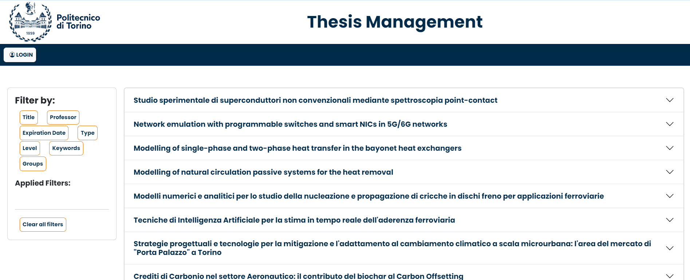

#### 2. First Common page - with filter. 
Everyone can browse interested thesis by applying filter .
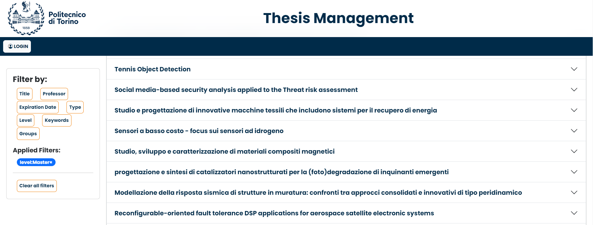

#### 3. login page. 
User can click top-right button to enter `login` page.
When submit username and password, the system will identify students or teachers automatically.
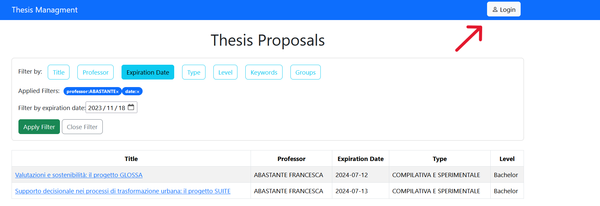
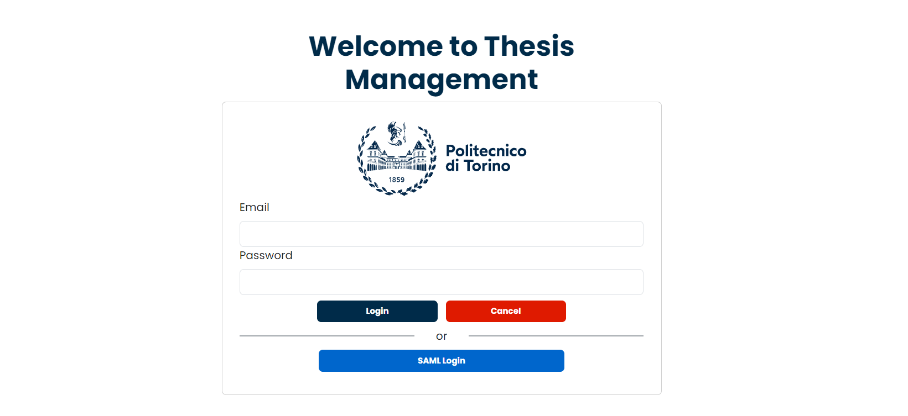

### Student Side. 
When user login as a student, he/she will enter in the Main Page for Student.
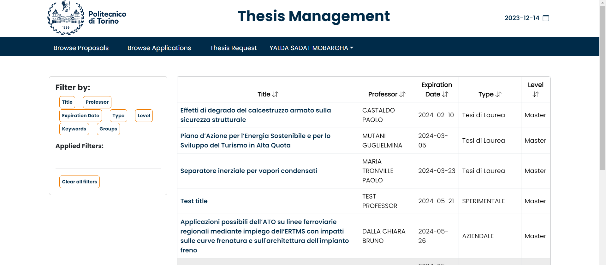

#### 1. Search Proposal page. 
Students can browse interested thesis by applying filter.
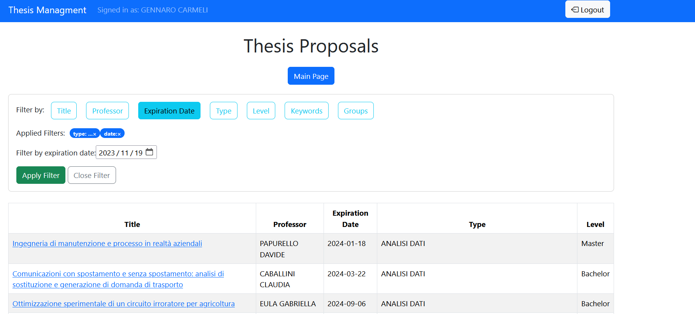

#### 2. Thesis apply page. 
Students can click on the thesis title directly to enter apply page when they find interested thesis.
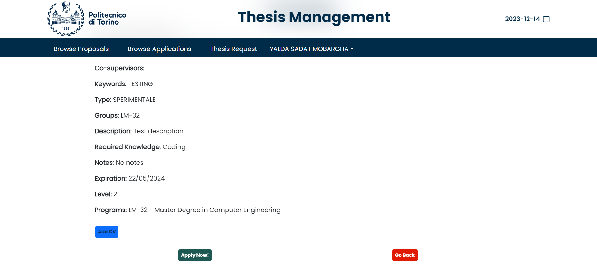

When they click 'Apply now!' button, they can view the new application status in 'Browse Decision' page later.
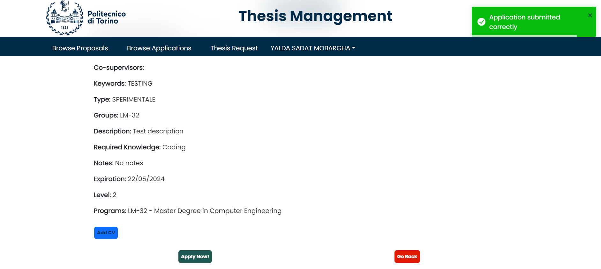

#### 3. Browse Decision page. 
Students can click on the right BIG button in the main page to view the descisions of their own applications by professor.
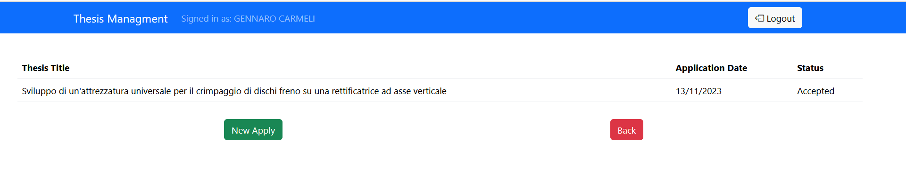


### Teacher Side. 
When user login as a professor, he/she will enter in the Main Page for Professor.
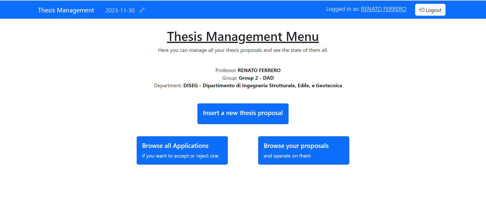

#### 1. Search Proposal page. 
Professors can browse interested thesis by applying filter.
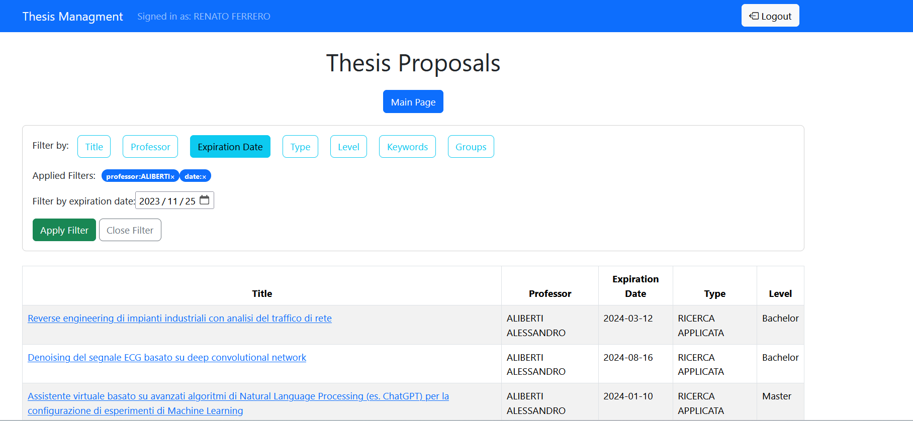

#### 2. Thesis detail page. 
Professors can browse interested thesis details by clicking on the thesis title directly.
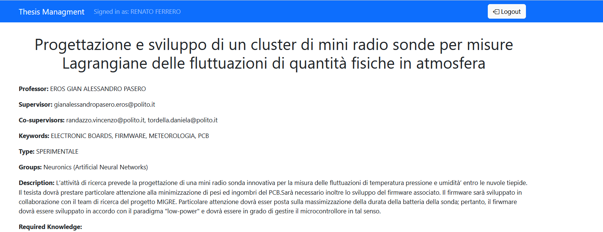

#### 3. Insert thesis page. 
Professors can click on button 'Insert a new thesis proposal' in the main page to create a new proposal.
When enter in the page, they can input data and insert.
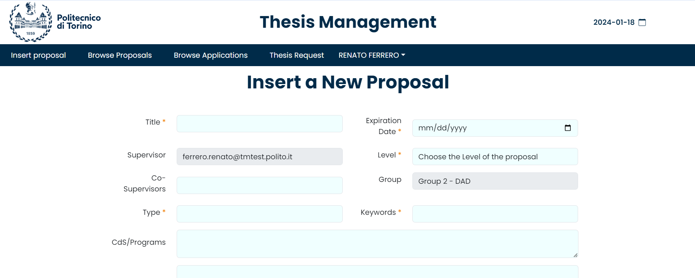

When they finish inerting, they can view the new proposal summary in 'Browse your Proposals' page.
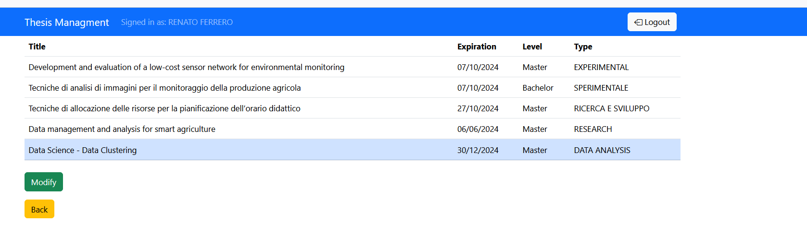

#### 4. Browse thesis page. 
Professors can click on button 'Browse your Proposals' in the main page to browse their own proposals.
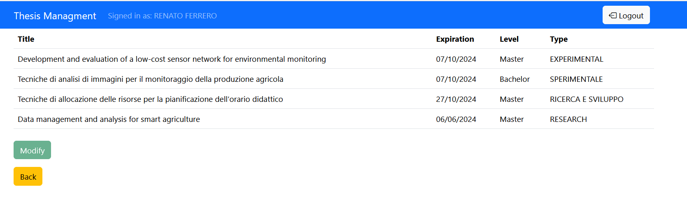

When they click on a proposal, they can active the 'Modify' button and enter a page to modify the proposal information.
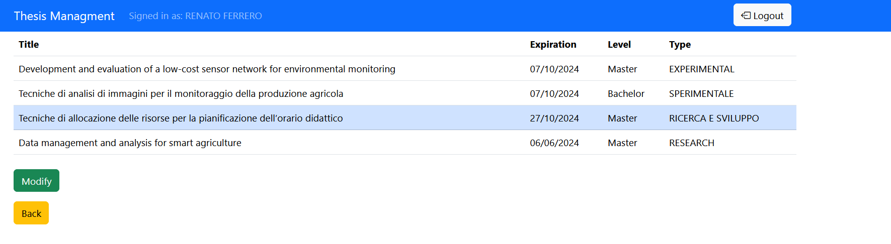


