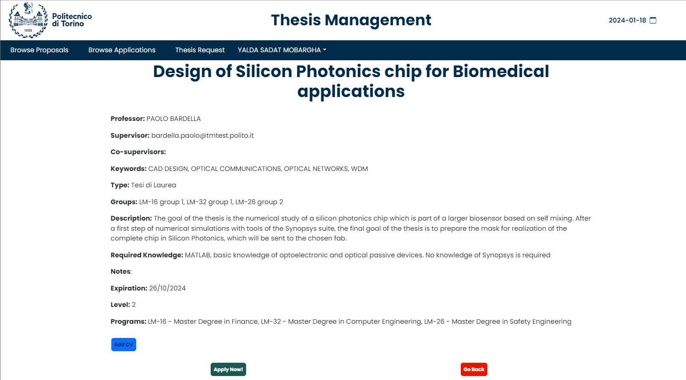
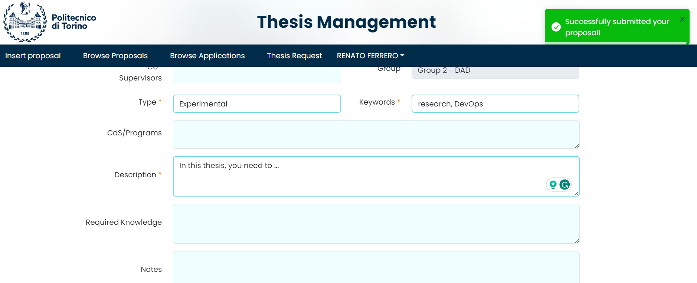
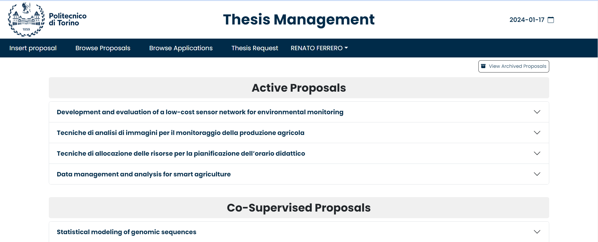
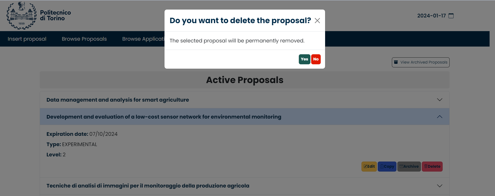

# Thesis Management - Front-end

## Thesis Management

_Thesis Management_ is a web application designed to help students and professors in keeping track of their thesis proposals and secratary clerks to control the thesis acceptance procedure.
_Students_ can log in and search for thesis topics that they are interested in, apply for them, add their CV and check their applications' statuses and make request for the theses wheter they have got accepted applications or not.
_Professors_ can create new thesis topics, process student applications and requests also manage their own thesis projects.

## Applied technologies

The front-end is implemented by means of '__HTML__ + __CSS__ + __JavaScript__ + __React__ + __Vite__'

## Front-end schema


## Front-end architecture

```
ThesisManagement
└── frontend
    └── src
        ├── pages
           └── ApplyToProposal.jsx  
           └── BrowseAndAcceptApplication.jsx
           └── BrowseApplicationDecision.jsx 
           └── BrowseArchivedProposals.jsx 
           └── BrowseProposal.jsx
           └── ClerkManagmentRequest.jsx
           └── InfoBox.jsx 
           └── LoginPage.jsx 
           └── MainPage.jsx 
           └── Navigation.jsx
           └── ProfessorManagementRequest.jsx
           └── ProposalForm.jsx 
           └── SearchForProposals.jsx  
           └── ThesisRequest.jsx
        ├── API.JSX  
        └── APP.css
        └── APP.jsx
        └── APPContext.jsx 
        └── index.css
        └── main.jsx
```
Short description of the pages:
1. _ApplyToProposal.jsx_: page for applying to a proposal.
2. _BrowseAndAcceptApplication.jsx_: page for professor accepting or rejecting students' applications.
3. _BrowseApplicationDecision.jsx_: page for browsing students' applications decisions.
4. _BrowseArchivedProposals.jsx_: page for managing the archived proposals.
5. _BrowseProposal.jsx_: page for browsing active proposals.
6. _ClerkManagmentRequest.jsx_: page for the clerck to accept or reject requests.
7. _InfoBox.jsx_: page for displaying all kinds of service information.
8. _LoginPage.jsx_: page for login function.
9. _MainPage.jsx_: main page of the application.
10. _Navigation.jsx_: page for identifying the user's status.
11. _ProfessorManagementRequest.jsx_: page to review the requests made by students.
12. _ProposalForm.jsx_: page for formatting proposals' data.
13. _SearchForProposals.jsx_: page for searching proposals with eventual filters.
14. _ThesisRequest.jsx_: page for making new requests by the student.

## How to use

1. Open a terminal in `frontend` folder.
2. Run `npm install` to install all the dependencies
3. Run `npm run dev` to start loading pages.
4. Open a browser and input `http://localhost:5173/`.

## Pages Guide

### Common Page

#### 1. First Common page.

_Everyone_ can browse all active thesis proposals.


also the details of any of the theses can be viewed.


#### 2. First Common page - with filter.

_Everyone_ can browse thesis proposals by applying filter.


#### 3. Login page.

A _user_ can click the top-left button to access the `login` page.
When valid username and password are submitted, the system will identify the student, secretary clerk or the professor automatically.

For the login, the user has 2 different options to choose between them, one is normal Login and the other one is login with SAML.


### Student Side.

When a _user_ has logged in as a _student_, the user will access the pages for Student.

#### 1. Browse Proposal page.

This page is infact the first page that the student will be redirected after successful login. In this page _Students_ can browse proposals related to their degree, its also possible to apply filters and see more details of each thesis by clicking on them.


By clicking on 'view' button of each proposal _Students_ can see all the details of the thesis proposal and from the end of the page they can directly click on the `apply` button to apply for it, when they find a thesis in which they are interested.



In this page _Students_ also can upload their CV when applying for a thesis.


After clicking the 'Apply now!' button, the student will get a question in order too confirm his decision.


In case of positive answer to the question and successful apply, a pop-up notification will be shown on the right side of the page to notify the student of successfull operation, and then the student will be able to view the new application status in `Browse Applications` page.


#### 2. Browse Applications page.

_Students_ in this are able to see the list of the thesis proposals that have applied for them, and the status of their applications that wheter its accepted, rejected or still processing.


if the _Students_ have been waiting for decisions on their applications, in case of acception or rejection of their application they will recieve an email containing the result of professors decision.

#### 3. Thesis Request .

_Students_ can make thesis requests in this page, for making a request they can choose a thesis from their already accepted proposals or from all the other thesis proposals.


In the procedure of making a request the _Students_ can change, Title, Description and cosupervisors of the thesis.


By clicking on the 'Send request' button, the student will get a question in order to confirm that wants to make this request.


If the student does not have any other requests, wheter accpeted or processing, then the request will be send to the secretary in case of answering 'yes' to the confirmation question.

### Teacher Side.

When a _user_ has logged in as a _professor_, the user access the pages dedicated to the Professor.

#### 1. Insert Proposal.

_Professors_ can click on "Insert Proposal" to go to the `Insert Proposal` page from the top of the page.
Then a form will be shown, the mandatory fields are shown with a star and should be filled in order to save the proposal.


After filling out the form and providing all the essential information, by clicking on the "Insert" button, there will be a question for the professors to confirm the insertion of the proposal. 


In case of successful insertion a pop-up notification will be shown on the top right of the page, and then the new proposal will be published and the students can view and apply for it.



Afterwards the professor can view the new inserted proposal summary in `Browse Proposals` page.

#### 2. Browse proposals.

_Professors_ can browse thesis prposals that they have created and are still active, it means that they have not expired yet and they have no accepted application.



from this page by clicking on the _"View Archived Proposals"_ button on the top right side of the page, _Professors_ can have access to their proposals that have been expired or have accepted applications, and also can search between them.


from these pages the _Professors_ also have the capability of update, copy, Archive and Delete their thesis proposals by clicking on the buttons related to each of them.


By clicking on the "copy" and "update" buttons the professor will be redirected to the form prefilled with the information of the chosen proposal, and from there, the professor can change the information related to the chosen proposal.

By clicking on the "archive" button, the thesis will be moved from Active section to Archived section and the students can not apply for that specific thesis proposal anymore.

By clicking on the "delete" button the professor will get an question to confirm the deletion of the selected proposasl.



In this page, another kind of thesis proposals are also shown, that are the proposals that the professor is chosen as their co-supervisor. This proposals are under the Active proposals and are indicated with 'Co-Supervised Proposals' title.

#### 3. Browse Applications.

When _Students_ send a new application to a _Professor_ , it will be shown in this page with all the applications for the professor and the professor can check them from here.


All the applications related to the professor thesis proposals are available in this page. _Professors_ can see the Information of the student and process the students' applications by clicking on the button `Accept` or `Reject` in the page. 
Also if the student had uploaded a _CV_ it will be visible in this section and professor can download student's file.
Another CV is available here marked as 'generated CV' that is generated automatically from the students courses and points related to them.


After processing, _Professors_ can see the application's status in the same page.

#### 4. Thesis Request.

When _Students_ send a new thesis request to a _Professor_ , after confirmation by the clerk the requests will be shown in this page.


The _Professor_ can view the details of the request and `Accept` or `Reject`it directly or in case of any mistakes by the student, the _Professor_ can send it back to the student for modifications and can also ask the exact changes in the comments box.


### Secretary Clerk Side.

When a _user_ has logged in as a _clerk_, the user access the pages dedicated to the clerk.

In the 'Manage Requests' section, _clerks_ can view all the requests made by students and the _clerk_ should check the details and if the request doesn't have any errors and is acceptable then _clerk_ can `Accept` it and the request will be send to the professor.
The _clerk_ also can `Reject` the request and therefore it will not be send to the professor never.


After clicking on accept button, a question will be shown to the clerk for confimation of the request acceptance.


When the _clerk_ accepts a request, in case of successfull acceptance, a mesage will be shown on the top right to notify the clerk, and afterwards the request will not be shown for the clerk anymore.

