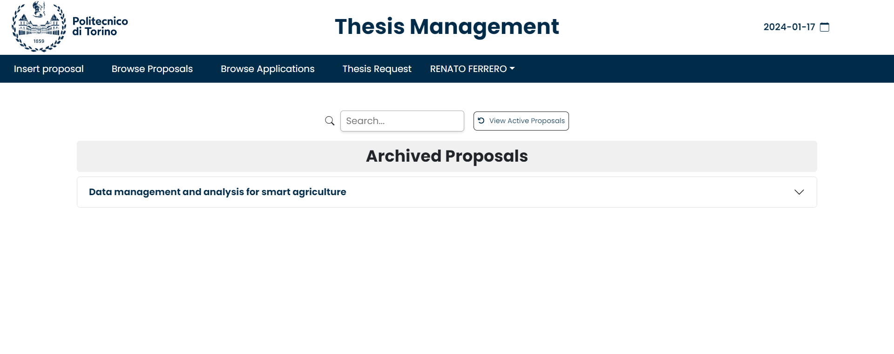
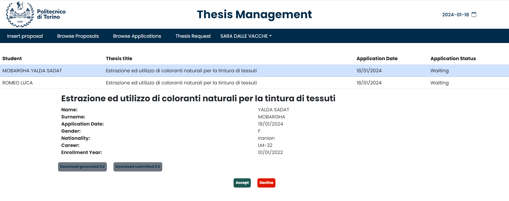

# Thesis Management - Front-end

## Thesis Management

_Thesis Management_ is a web application designed to help students and professors in keeping track of their thesis proposals and secratary clercks to control the thesis acceptance procedure.
_Students_ can log in and search for thesis topics that they are interested in, apply for them, add their CV and check their applications' statuses and make request for the thesises wheter they have got accepted applications or not.
_Professors_ can create new thesis topics, process student applications and manage their own thesis projects.

## Applied technologies

The front-end is implemented by means of '__HTML__ + __CSS__ + __JavaScript__ + __React__ + __Vite__'

## Front-end schema


## Front-end architecture

```
ThesisManagement
└── frontend
    └── src
        ├── pages
           └── ApplyToProposal.jsx  
           └── BrowseAndAcceptApplication.jsx
           └── BrowseApplicationDecision.jsx 
           └── BrowseArchivedProposals.jsx 
           └── BrowseProposal.jsx
           └── ClerkManagmentRequest.jsx
           └── InfoBox.jsx 
           └── LoginPage.jsx 
           └── MainPage.jsx 
           └── Navigation.jsx
           └── ProposalForm.jsx 
           └── SearchForProposals.jsx  
           └── ThesisRequest.jsx
        ├── API.JSX  
        └── APP.css
        └── APP.jsx 
        └── index.css
        └── main.jsx
```

1. _ApplyToProposal.jsx_: page for applying to a proposal.
2. _BrowseAndAcceptApplication.jsx_: page for professor accepting or rejecting students' applications.
3. _BrowseApplicationDecision.jsx_: page for browsing students' applications decisions.
4. _BrowseArchivedProposals.jsx_: page for managing the archived proposals.
5. _BrowseProposal.jsx_: page for browsing active proposals.
6. _ClerkManagmentRequest.jsx_: page for the clerck to accept or reject requests.
7. _InfoBox.jsx_: page for displaying all kinds of service information.
8. _LoginPage.jsx_: page for login function.
9. _MainPage.jsx_: main page of the application.
10. _Navigation.jsx_: page for identifying the user's status.
11. _ProposalForm.jsx_: page for formatting proposals' data.
12. _SearchForProposals.jsx_: page for searching proposals with eventual filters.
13. _ThesisRequest.jsx_: page for making new requests by the student.
11. _API.jsx_: page for connecting to backend.
12. _APP.jsx_: page for routing all pages.

## How to use

1. Open a terminal in `frontend` folder.
2. Run `npm install` to install all the dependencies
3. Run `npm run dev` to start loading pages.
4. Open a browser and input `http://localhost:5173/`.

## Pages Guide

### Common Page

#### 1. First Common page.

_Everyone_ can browse all active thesis proposals.


#### 2. First Common page - with filter.

_Everyone_ can browse thesis proposals by applying filter.


#### 3. First Common page - sort columns.

_Everyone_ can sort thesis proposals from the top of each column for example sort based on the expiration date.


#### 4. Login page.

A _user_ can click the top-left button to access the `login` page.
When valid username and password are submitted, the system will identify the student or the professor automatically.

For the login, the user has 2 different options to choose between them, one is normal Login and the other one is login with SAML.


### Student Side.

When a _user_ has logged in as a _student_, the user will access the `Main Page` for Student, that thesis proposals are shown, this page is browse proposals page.


#### 1. Browse Proposal page.

This page is infact the main page that the studentwill be redirected after successful login.In this page _Students_ can browse thesis by applying filters, sort each column of the thesis proposals and see more details of each thesis by clicking on them.

#### 2. Thesis apply page.

_Students_ can directly click on the thesis title to access the `apply` page when they find a thesis in which they are interested.


In this page _Students_ also can upload their CV when applying for a thesis.


After clicking the 'Apply now!' button, the student will get a question in order too confirm his decision.


In case of positive answer to the question and successful apply, a pop-up notification will be shown on the right side of the page to notify the student of successfull operation, and then the student will be able to view the new application status in `Browse Applications` page.


#### 3. Browse Applications page.

_Students_ in this are able to see the list of the thesis proposals that have applied for them, and the status of their applications that wheter its accepted, rejected or still processing.


if the _Students_ have been waiting for decisions on their applications, in case of acception or rejection of thier application they will recieve an email containing the result of professors decision.

#### 4. Thesis Request .

_Students_ can make thesis requests in this page, for making a request they can chose a thesis from their already accepted proposals or from all the other thesis proposals.
In the procedure of making a request the _Students_ can change, Title, Description and cosupervisors of the thesis.


By clicking on the 'Send request' button, the student will get a question in order to confirm that wants to make this request.

### Teacher Side.

When a _user_ has logged in as a _professor_, the user access the pages dedicated to the Professor.

#### 1. Browse proposals.

_Professors_ can browse thesis prposals taht they have created and are still active, it means that they have not expired yet and they have no accepted application.


from this page by clicking on the _"View Archived Proposals"_ button, _Professors_ can have access to their proposals that have been expired or have accepted applications.


from these pages the _Professors_ also have the capability of update, copy, Archive and Delete their thesis proposals by clicking in order to the buttons on the right side of each proposal.


By clicking on the copy and update buttons the professor will be redirected to the form prefilled with the information of the chosen proposal, and from there the professor can change the information.

By clicking on the "delete" button the professor will get an question to confirm the deletion of the selected proposasl.


#### 2. Browse Applications.

When _Students_ send a new application to a _Professor_ , it will be shown in this page with all the applications for the professor and the professor can check it from here.


_Professors_ can process the students' applications by clicking on the button `Accept` or `Reject` in the page. 
Also if the student had uploaded a CV it will bevisible in this section and professor can download students file.
Another CV is available here marked as 'generated CV' that is generated from the students courses and points related to them.


After processing, _Professors_ can see the application's status in the same page.

#### 3. Insert Proposal.

_Professors_ can click on go to the `Insert Proposal` page from the top of the page.
Then a form will be shown, the mandatory fields are shown with a star and should be filled in order to save the proposal.


After filling out the form and clicking on the "Insert" button, there will be a question for the professors to confirm the insertion of the proposal.


In case of successful insertion a pop-up notification will be shown on the top right of the page.


Afterwards they can view the new proposal summary in `Browse Proposals` page.


### Secretary Clerk Side.

When a _user_ has logged in as a _clerk_, the user access the pages dedicated to the clerk.

_clerks_ can view the requests made by students for a specific proposal and they can "Accept" or "Reject" the requests.
