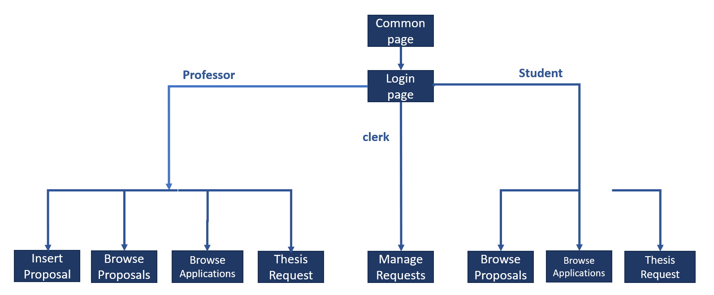
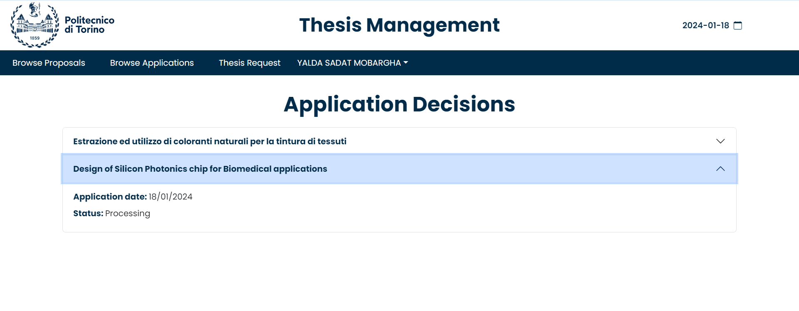

# Thesis Management - Front-end

## Thesis Management

_Thesis Management_ is a web application designed to help students and professors in keeping track of their thesis proposals.\
_Students_ can log in and search for thesis topics that they are interested in, apply for them and check their applications' statuses.\
_Professors_ can view thesis that they are interested in, create new thesis topics, process student applications and manage their own thesis projects.

## Applied technologies

The front-end is implemented by means of '__HTML__ + __CSS__ + __JavaScript__ + __React__ + __Vite__'

## Front-end schema


## Front-end architecture

```
ThesisManagement
└── frontend
    └── src
        ├── pages
           └── ApplyToProposal.jsx  
           └── BrowseApplicaionDecision.jsx  
           └── BrowseProposal.jsx
           └── InfoBox.jsx 
           └── LoginPage.jsx 
           └── MainPage.jsx 
           └── Navigation.jsx
           └── ProposalForm.jsx 
           └── SearchForProposals.jsx    
        ├── API.JSX  
        └── APP.css
        └── APP.jsx 
        └── index.css
        └── main.jsx
```
1. _ApplyToProposal.jsx_: page for applying to a proposal.
2. _BrowseApplicationDecision.jsx_: page for browsing students' applications decisions.
3. _BrowseProposal.jsx_: page for browsing active proposals.
4. _InfoBox.jsx_: page for displaying all kinds of service information.
5. _LoginPage.jsx_: page for login function.
6. _MainPage.jsx_: main page of the application.
7. _Navigation.jsx_: page for identifying the user's status.
8. _ProposalForm.jsx_: page for formatting proposals' data.
9. _SearchForProposals.jsx_: page for searching proposals with eventual filters.
10. _API.jsx_: page for connecting to backend.
11. _APP.jsx_: page for routing all pages.

## How to start using
1. Open a terminal in `frontend` folder.
2. Run `npm install` to install all the dependencies
3. Run `npm run dev` to start loading pages.
4. Open a browser and input `http://localhost:5173/`.

## Pages Guide

### Common Page

#### 1. First Common page.
_Everyone_ can browse all active thesis.


#### 2. First Common page - with filter.
_Everyone_ can browse thesis by applying filter .


#### 3. Login page.
A _user_ can click the top-right button to access the `login` page.\
When valid username and password are submitted, the system will identify the student or the professor automatically.


### Student Side.
When a _user_ has logged in as a _student_, he/she will access the `Main Page` for Student.


#### 1. Search Proposal page.
_Students_ can browse thesis by applying filters.


#### 2. Thesis apply page.
_Students_ can directly click on the thesis title to access the `apply` page when they find a thesis in which they are interested.


After clicking the 'Apply now!' button, they will be able to view the new application status in `Browse Decision` page later.


#### 3. Browse Decision page.
_Students_ can click on the right BIG button in the main page to view the decisions of their own applications made by the professors.


### Teacher Side.
When a _user_ has logged in as a _professor_, he/she will access the `Main Page` for Professor.


#### 1. Search Proposal page.
_Professors_ can browse thesis by applying filters.


#### 2. Thesis detail page.
_Professors_ can browse thesis details by directly clicking on the thesis title.


#### 3. Insert thesis page.
_Professors_ can click on the button `Insert a new thesis proposal` in the main page to create a new proposal.\
When accessing the page, they can insert data.


When they are finished, they can view the new proposal summary in `Browse your Proposals` page.


#### 4. Browse thesis page.
_Professors_ can click on the button `Browse your Proposals` in the main page to browse their own proposals.


When they click on a proposal, they can click on the `Modify` button and access a page to modify the proposal information.

